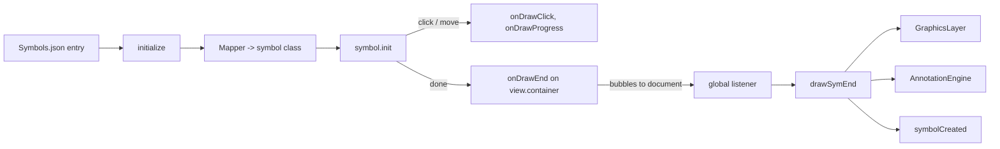

# Drawing Flow and Events

This document describes how a symbol goes from a catalogue entry to a graphic on the map, and lists every `CustomEvent` that the library dispatches, with payloads, timing and scoping rules. It was written from the source in `MS/Engines/SymbolEngine.ts`, `MS/Support/SymbolEvents.ts`, `MS/Symbols/*` and the engine files named in each table.

Related documents: [README](README.md) | [Getting started](01-getting-started.md) | [SymbolEngine API](02-symbol-engine-api.md) | [Support classes](04-support-classes.md) | [Editing and Morphix](05-editing-morphix.md) | [Settings](08-settings.md) | [Measurement, cues, MGRS](09-measurement-cues-mgrs.md) | [Symbol catalog](13-symbol-catalog.md) | [FAQ](14-faq-troubleshooting.md)

## Contents

| Section | What it covers |
| --- | --- |
| [The drawing flow](#the-drawing-flow) | Eight steps from `Symbols.json` to `AnnotationEngine` |
| [Draw events emitted by symbol classes](#draw-events-emitted-by-symbol-classes) | `onDrawClick`, `onDrawProgress`, `onDrawEnd`, `onBaseLineDrawEnd` |
| [Events dispatched by SymbolEngine](#events-dispatched-by-symbolengine) | `symbolCreated`, `symbolDetailsRequested`, `settingChanged`, `*Ready`, ... |
| [Events from other engines and managers](#events-from-other-engines-and-managers) | Measurement, proximity, drawing cue, declutter, road network, theme, log, settings |
| [Scoping to the emitting view](#scoping-to-the-emitting-view) | How several views or engines coexist |
| [Subscribing and unsubscribing](#subscribing-and-unsubscribing) | Host patterns |

---

## The drawing flow

### Step 1: Symbols.json metadata

`MS/Data/Symbols.json` is keyed by symbol-set plus entity id (for example `"00000001"` is Freehand - Line). Each entry has at least `Class`, `Name`, `SymGeoType` (`Point`, `FPoint`, `Polyline` or `Polygon`), and usually `Parameters`, `Offset` and `Fill`. Freehand entries carry `isFreeHand: "1"`. `Parameters` entries have `Name`, `default`, `description` and `value` (the `DrawEssentials` field they populate).

The lookup key is built in `initialize()` from the SIDC of `amplifier.SIDC`:

```
key = SIDC.substring(4, 6)   // symbol set, as returned by getSIDC()
    + SIDC.getSID()          // characters 10..16 of the SIDC (six-digit entity id)
```

Example: SIDC `10110201004100000000` gives symbol set `02` and SID `004100`, so the key is `02004100`. If the key is missing, `initialize()` logs `console.warn('Symbol data not found for SIDC part: <key>')` and returns; it does not throw.

### Step 2: SymbolEngine.initialize()

`initialize(drawEssentials, amplifier, isPassive?)` ([reference](02-symbol-engine-api.md#initializedrawessentials-drawessentials-amplifier-amplifier-ispassive-boolean-void)):

1. Cancels a pending continuous-mode re-arm and stores the arguments for continuous mode (interactive calls only).
2. For interactive calls, closes any active edit workflow, marks `SelectionEngine` as drawing, and arms `ProximityEngine` and `DrawingCueEngine`.
3. Parses the SIDC and snapshots the SIDC and amplifier of this draw session. `drawSymEnd()` later reads the snapshot, so a second `initialize()` (re-pick, continuous mode) cannot change the identity of a draw that is still finishing.
4. Resolves the `Symbols.json` entry.

### Step 3: Mapper resolves the class

`getSymbol()` creates `new Mapper(entry.Class)` and calls `getInstance()`. `Mapper` holds a static name-to-class table in `MS/Engines/Mapper.ts`; an unknown class name throws `Error('Symbol class <name> not found')` (inside `initialize()` this is caught and logged with `console.error`). The class is then constructed as `new SymbolClass(view, isLine)`, where `isLine` is `drawEssentials.IS_LINE`. The instance receives `amplifier` as a property.

### Step 4: Symbol init()

Depending on `SymGeoType`:

- `Point` and `FPoint` (tactical points and unit/equipment symbols): a marker is built from the SIDC (`sidc.getMarker(...)`), `extraSettings` (`lineWidth`, `size`, `opacity`) are applied, and `symbol.init(drawEssentials, marker, sid, name, offset, sidcString)` is called. For passive placement `GEOM` is re-projected to the view's spatial reference.
- `Polyline` and `Polygon` (tactical line/area, freehand): the marker (line or fill symbol) is built, `extraSettings` and the freehand draw-style are applied, passive `CTRL_PTS` and `BASE_LN_PTS` are re-projected, then `symbol.init(drawEssentials, marker)` is called.

The symbol's `init()` selects one of three placement modes. Classes that extend `____TacticalSymbolBase` share this logic (see `MS/Symbols/____TacticalSymbolBase.ts`, `PhaseLine.ts`):

| Mode | Trigger (`options`) | Result |
| --- | --- | --- |
| Control points and geometry given | `CTRL_PTS` present and `GEOM` non-null | Geometry taken from `GEOM`, placed immediately, `onDrawEnd` emitted. |
| Control points given | `CTRL_PTS` present, no `GEOM` | Geometry rebuilt with `createSymbol()`, placed immediately, `onDrawEnd` emitted. |
| Interactive | no `CTRL_PTS` | Click, double-click and pointer-move handlers are registered on the view. |

The exact discrimination logic for legacy classes that do not extend the base class is not uniform; treat the three modes as the documented contract of the base class only.

Interactive behaviour of a base-class symbol: each click appends a vertex and emits `onDrawClick`; pointer movement rebuilds the geometry and emits `onDrawProgress`; a double-click adds a final vertex and completes; completion emits `onDrawEnd` and removes the handlers. Some symbols complete after a fixed number of clicks. `deactivate()` abandons a draw and removes the handlers.

After `init()`, for passive placement `initialize()` calls `symbol.deactivate?.()` so leftover view listeners are released.

### Step 5: onDrawClick / onDrawProgress / onDrawEnd

Symbol classes emit through `SymbolEvents.emit(name, data)`. It (a) calls in-instance listeners added with `symbol.on(...)`, and (b) dispatches a bubbling, cancelable `CustomEvent` on the view container:

```typescript
new CustomEvent(eventName, {
  detail: { symbolType, eventName, ...data },
  bubbles: true,
  cancelable: true,
});
// dispatched on view.container; falls back to document if the view has no container
```

Payloads are in [Draw events emitted by symbol classes](#draw-events-emitted-by-symbol-classes).

### Step 6: SymbolEngine's global listeners

`setupGlobalEventListener()` (called in the constructor) registers three listeners on `document`. Each first applies the [view scope check](#scoping-to-the-emitting-view).

| Event | What the engine does |
| --- | --- |
| `onDrawProgress` | Clears the "freehand armed" flag, activates proximity and drawing cues (idempotent), and feeds `currentGeometry` and `currentDrawEssentials.CTRL_PTS` into `MeasurementEngine.updateSegments()` and `DrawingCueEngine.updateFromProgress()` (only when both are present). |
| `onDrawClick` | If `detail.currentPts` is set, calls `MeasurementEngine.addSegment(currentPts)`. |
| `onDrawEnd` | Calls `drawSymEnd(detail)`, then (unless lifecycle is suppressed for programmatic re-renders) calls `MeasurementEngine.wrapUp()` and deactivates proximity and drawing cues. |

### Step 7: drawSymEnd builds the graphic and adds it to a layer

`drawSymEnd(detail)` (private) reads `geometry`, `marker`, `drawEssentials` and `symbolType` from the event detail. If `geometry` or `marker` is missing it logs a warning and stops. Otherwise it:

1. Creates `new Graphic({ geometry, symbol: marker })`.
2. Stores `drawEssentials` on the graphic. `drawEssentials.SIDC` and `.AMPLIFIER` are overwritten from the per-draw snapshot of step 2, so after this step `drawEssentials.AMPLIFIER` is the `Amplifier` object, not a string.
3. Sets attributes `{ drawEssentials, type: symbolType || 'symbol', id }`. The id comes from a pending id (plan load, paste, Morphix re-render), else a generated UUID. `graphic.id` is set to the same value.
4. Picks the layer (`getDrawEndLayer`): `UEI` equal to `'1'` or `SYM_GEO_TYPE` `fpoint` goes to `ForceSymbolsLayer`; `SYM_GEO_TYPE` `point` or a point geometry goes to `TacticalPointSymbolsLayer`; anything else goes to `TacticalSymbolsLayer`.
5. For minefield polygons, syncs the textured 3D child.
6. Pushes an undo entry labelled `Add <SYM_NAME>` (skipped once when a pending "suppress add undo" counter is set, for example during paste and re-render).

### Step 8: AnnotationEngine labels

If `drawEssentials.AMPLIFIER` is set, `AnnotationEngine.annotate(annotationLayer, geometry, amplifier, drawEssentials, id, textSize, isFreeHand, labelOptions, options)` writes label graphics to `AnnotationLayer`, keyed by the graphic id (`deAnnotate(layer, id)` removes them). `labelOptions` come from `drawEssentials.labelOptions` given to `initialize()`. `drawEssentials.opacity`, if present, is deleted afterwards.

Finally, unless suppressed, the engine emits `symbolCreated` on the view container (and calls its internal `emit('symDrawEnd', ...)`, which has no external subscribers, see [02](02-symbol-engine-api.md#emittype-string-event-any-boolean)). In continuous creation mode it then schedules `initialize()` again with the same parameters.



---

## Draw events emitted by symbol classes

Dispatched on `view.container` (or `document` when the view has no container), `bubbles: true`, `cancelable: true`. Source: `MS/Support/SymbolEvents.ts`, plus copies of the same logic in `TacticalPointText.ts`, `TacticalPointTextBox.ts` and `CartoInformationModelSymbol.ts`. 160 of the 184 files in `MS/Symbols/` use `SymbolEvents`.

Common `detail` fields on every one of them: `symbolType: string` (the symbol's channel name, normally the class name such as `"PhaseLine"`) and `eventName: string` (the event name again).

| Event | When fired | Additional `detail` fields |
| --- | --- | --- |
| `onDrawClick` | A vertex or control point is placed | `currentPts: Point[]` (the points so far). Emitted by symbol classes with the same field name; a few symbols may add fields. |
| `onDrawProgress` | Pointer moves during an interactive draw and the preview geometry changed | `currentGeometry: Geometry`, `currentDrawEssentials: DrawEssentials` (with `CTRL_PTS`, `DRAW_TYPE`, ...), `currentMarker` (the line/fill symbol in use). |
| `onDrawEnd` | The symbol is complete (interactive completion or immediate placement) | `geometry`, `marker`, `drawEssentials`. Base-class tactical symbols also add `geographicGeometry` (a clone when the view's `wkid` is 4326, otherwise the same object as `geometry`). |
| `onBaseLineDrawEnd` | Two-phase symbols (base line finished, before the second phase). Emitted by symbols such as `AttackByFirePosition` and `Block`. | `currentPts: Point[]` (base line control points). The SymbolEngine does not listen to it. |

Notes:

- `onDrawEnd.detail.drawEssentials.SCOPE` (base-class symbols) points at the symbol instance. `EditEngine` uses `SCOPE.createSymbol(de)` to re-render edits.
- The document-level `onDrawProgress` is also dispatched manually by `drawMilSymbolInteractively()` (with `symbolType: 'milSymbol'`, `currentGeometry`, and `currentDrawEssentials: { AMPLIFIER }`). It is dispatched on `document`, so it is always accepted by the scope check.
- The SymbolEngine itself also dispatches `onDrawProgress` and `onDrawEnd` from `registerSymbol()` (legacy). Their detail differs: `{ symbolType, currentGeometry, currentDrawEssentials, currentMarker, originalData }` and `{ symbolType, originalData }`. See the caution in [02](02-symbol-engine-api.md#registersymbolsymbolinstance-any-symboltype-string-void).
- Host code may listen to these events for its own UI (live readouts, enabling a Cancel button). Do not dispatch them yourself with a made-up `detail`: `onDrawEnd` on `document` is treated as a finished symbol by every engine that has the global listener attached.

```typescript
document.addEventListener('onDrawProgress', (e) => {
  const d = (e as CustomEvent).detail;
  console.log(d.symbolType, d.currentGeometry?.type);
});
```

---

## Events dispatched by SymbolEngine

Dispatched with the private `emitEvent(name, data)`: a `CustomEvent` with `detail: data`, `bubbles: true`, `cancelable: true`, dispatched on `view.container` of the view returned by the provider at that moment, or on `document` when there is no container.

| Event | When fired | `detail` |
| --- | --- | --- |
| `symbolCreated` | After a genuine placement completes (interactive draw, paste, duplicate, programmatic passive placement). Not fired for suppressed re-renders such as Morphix edits, where `symbolDetailsEdited` fires instead. | `{ graphic: Graphic, id: string, drawEssentials: DrawEssentials, isDone: 'done' }` |
| `symbolDetailsEdited` | After `applyMorphixEdit()` (and therefore `updateSymbol()` and the Morphix modal) re-renders a symbol | `{ graphic: Graphic (the new instance), id: string, drawEssentials }` |
| `symbolDetailsRequested` | The user chooses Show Details in the context menu (or the `I` shortcut). **Cancelable.** Call `event.preventDefault()` to claim it and show your own editor; if not prevented, the built-in Morphix modal opens. | `{ graphic: Graphic, state: MorphixSymbolSnapshot }` |
| `symbolAction` | A context-menu item was clicked (fired for every item, after the item's own action) | `{ type: string (the menu item id, for example 'copy-symbol', 'paste-symbol', 'paste-symbol-offset', 'undo', 'redo', 'show-details', 'center-on', 'remove-graphic', plus ids of any other registered menu item), graphic, layerId, graphicType, point }` |
| `creationModeChanged` | `stopContinuousMode()` reverted continuous mode | `{ mode: 'single' }`. Not fired by the `creationMode` setter or by `onSettingChanged(['creationMode'], ...)`. |
| `settingChanged` | At the end of every `onSettingChanged()` call | `{ path: string (joined with '.'), value: any }` |
| `measurementEngineReady` | MeasurementEngine loaded and started | `{ engine: MeasurementEngine }` |
| `proximityEngineReady` | ProximityEngine created | `{ engine }` |
| `drawingCueEngineReady` | DrawingCueEngine created | `{ engine }` |
| `mgrsEngineReady` | MGRSEngine created | `{ engine }` |
| `visualizationEngineReady` | VisualizationEngine created | `{ engine }` |
| `roadNetworkEngineReady` | RoadNetworkEngine attached (after the backend probe succeeds) | `{ engine }` |
| `trafficabilityEngineReady` | TrafficabilityEngine created | `{ engine }` |
| `deploymentBuilderEngineReady` | DeploymentBuilderEngine loaded | `{ engine }` |
| `briefingEngineReady` | BriefingEngine loaded | `{ engine }` |
| `screenAnchorEngineReady` | ScreenAnchorEngine loaded | `{ engine }` |
| `collabEngineReady` | CollabEngine loaded | `{ engine }` |
| `<name>Ready` for analysis engines | Created by `AnalysisEngineRegistry` when that engine is enabled. Names: `weaponEffectEngineReady`, `losEngineReady`, `trajectoryEngineReady`, `bufferEngineReady`, `corridorEngineReady`, `effectEngineReady`, `flightEngineReady`, `deadGroundMapperReady`, `keyTerrainIdentificationEngineReady`, `posDefScorerEngineReady`, `opRankerEngineReady`, `localPeaksEngineReady`, `ocokaEngineReady`, `missionPlannerEngineReady`, `landingZoneEngineReady`, `airspaceEngineReady` | `{ engine }` |

Notes:

- `*Ready` events fire during or after construction. Engines that load synchronously in the constructor fire before your code can attach a listener to a container that is not yet in the DOM; if you need an engine, read the getter (see [02](02-symbol-engine-api.md#sub-engine-and-manager-access)) first and listen only for later loads.
- The context-menu items that trigger `symbolAction` and `symbolDetailsRequested` are registered internally; the item ids above are those visible in `SymbolEngine.registerContextMenuItems()`.
- In the harness, `symbolDetailsRequested` is claimed to open the Symbol Params dock, and `symbolCreated` closes the dock unless creation mode is continuous. See `src/main.ts`.

```typescript
document.addEventListener('symbolDetailsRequested', (e) => {
  const ce = e as CustomEvent;
  if (!ce.detail?.graphic) return;
  ce.preventDefault();                       // claim: suppress the Morphix modal
  openMyEditor(ce.detail.graphic, ce.detail.state);
});
```

---

## Events from other engines and managers

These are dispatched by the named classes rather than by `SymbolEngine`. Most go to `document` (not the view container) and therefore are not view-scoped.

| Event | Target | Source | Fired when | `detail` |
| --- | --- | --- | --- | --- |
| `measurement-update` | `document`, bubbles | `MeasurementEngine` | Measurement values change | `MeasurementSnapshot`: `segmentLength, totalLength, area, bearing, height, width: string`, `unit`, `areaUnit`, optional `trueAzimuth, magneticAzimuth, gridAzimuth: number`, optional `roadInfo: string`. Fields may be partial. |
| `measurement-state-change` | `document`, bubbles | `MeasurementEngine` | Enabled or disabled | `{ state: 'enabled' \| 'disabled', isEnabled: boolean }` |
| `measurement-hint` | `document`, bubbles | `MeasurementEngine` | Guidance text changes | `{ message: string, phase: 'idle' \| 'drawing' \| 'segment' \| 'complete' }` |
| `measurement-graphic-measured` | `document`, bubbles | `ContextMenuManager` | "Measure This Symbol" chosen | `MeasurementSnapshot` plus `screenX`, `screenY` |
| `proximity-state-change` | `document`, bubbles | `ProximityEngine` | Enabled or disabled | `{ state: 'enabled' \| 'disabled', isEnabled: boolean }` |
| `proximity-snap` | `document`, bubbles | `ProximityEngine` | Snap coordinate moved by at least one map unit | `{ coordinate: { x, y }, distance: string, unit }` |
| `proximity-clear` | `document`, bubbles | `ProximityEngine` | Snap state cleared (once per cleared state) | none |
| `proximity-hint` | `document`, bubbles | `ProximityEngine` | Guidance text changes | `{ message: string, phase: 'idle' \| 'active' \| 'snapped' \| 'no-targets' }` |
| `drawing-cue-state-change` | `document`, bubbles | `DrawingCueEngine` | Cues activated or deactivated | `{ isActive: boolean }` |
| `declutter-solve-stats` | `document` | `DeclutterEngine` | After every declutter solve | `SolveStats`: `{ solveMs, indexSize, perStepMs: Record<string, number>, zoom, timestamp }` |
| `road-network:status` | `document`, bubbles | `RoadNetworkEngine` (constant `ROAD_NETWORK_STATUS_EVENT`) | Road-network service state changes | `{ state, info }` (types defined in `RoadNetworkEngine.ts`) |
| `ms-theme-changed` | `document` | `ThemeManager` | Theme changed | `{ theme: string }` |
| `engine-log` | `document`, bubbles | `EngineLogger` | Any engine logs, when `logging.enabled` is not false | `EngineLogEntry`: `{ engine: string, type: 'success' \| 'error' \| 'next-step', message: string, formatted: string, timestamp: Date }` |
| `settingsChanged` | `window` | `SettingsBus.setSetting()`, `DrawingCueEngine`, `MagneticCompass`, and the harness UI | A setting was changed from a widget | `{ path: string[], value: unknown, fullPath?: string }`. `fullPath` is present in `SettingsBus` and in some `DrawingCueEngine`/`MagneticCompass` dispatches, not in all. |

Notes:

- `settingsChanged` (window, from widgets) and `settingChanged` (view container, from `SymbolEngine.onSettingChanged`) are different events with similar names. See [08-settings.md](08-settings.md).
- Selection, edit and other engines expose their own `on(...)` subscription APIs (for example `selectionEngine.on('selectionChange', ...)`), which are not DOM events; see [06-selection-clipboard-undo-templates.md](06-selection-clipboard-undo-templates.md) and [05-editing-morphix.md](05-editing-morphix.md).
- Measurement and proximity engines are singletons and dispatch on `document`; with several views in one page, listeners on `document` cannot tell which view they belong to.

---

## Scoping to the emitting view

Draw events bubble from the `container` element of the view that owns the symbol being drawn. A `SymbolEngine` accepts an event only if it was born in its own view (`_isOwnViewEvent`, private):

1. If `event.target` is `document` (or missing), accept. Events dispatched straight on `document` have no container to attribute; this is how headless symbol use and unit tests work, and how `drawMilSymbolInteractively()` reports progress.
2. If the engine's current view has no `container`, accept.
3. Otherwise accept only when `event.target === view.container` or `view.container.contains(event.target)`.

The view is read from the provider at the time of the event, so after a 2D/3D switch the engine follows the new view's container. Consequences for hosts:

- Several `SymbolEngine`s on one page, each with its own view container, do not react to each other's draws. A symbol drawn in map A is not added by engine B.
- If two engines share a container (or one engine's container contains the other's), both accept the event and each adds the graphic. Avoid nesting map containers.
- An engine that is discarded must be torn down with `destroy()` or `removeGlobalEventListener()`; otherwise its `document` listeners stay attached and still process events from its old container.
- The `emitEvent()` events of section "Events dispatched by SymbolEngine" also go to the container of the current view, so a host listening on `document` sees the events of all engines. To filter by map, listen on the container element itself, or compare `event.target` with the container.

---

## Subscribing and unsubscribing

All events are standard DOM events. Use `addEventListener` and keep the same function reference for `removeEventListener`.

Listen globally or per map:

```typescript
const onCreated = (e: Event) => {
  const { id, graphic, drawEssentials } = (e as CustomEvent).detail;
  saveToServer(id, engine.getSymbolState(graphic));
};

// all maps on the page
document.addEventListener('symbolCreated', onCreated);
// only this map
mapContainer.addEventListener('symbolCreated', onCreated);

// unsubscribe
document.removeEventListener('symbolCreated', onCreated);
mapContainer.removeEventListener('symbolCreated', onCreated);
```

Rules that follow from the source:

- Target `view.container` when the page hosts more than one map. After a view switch the engine dispatches on the container of the newly active view, so add your listener to each container you can switch to, or listen on `document`.
- Call `preventDefault()` only on `symbolDetailsRequested`; it is the only event whose default action the library checks (via the boolean result of `dispatchEvent`).
- Do not rely on `stopPropagation()` on `onDrawEnd`/`onDrawProgress`/`onDrawClick` at the container: the engine's listener is on `document`, so stopping propagation at a container prevents the engine from creating the graphic and from updating measurement and cue overlays. The source does not present this as a supported way to veto placement.
- Symbol instances have their own `on(eventName, callback)` (and in `SymbolEvents`, `off(eventName, callback?)` and `clear()`), but instances are created internally by `initialize()`; hosts normally use the DOM events.
- Analysis and settings widgets that use `window.symbolEngine` require the global to be set. See [02](02-symbol-engine-api.md#global-exposure).
- To stop the engine reacting to draw events without destroying it: `engine.removeGlobalEventListener()`; resume with `engine.setupGlobalEventListener()` (idempotent).
- On teardown call `engine.destroy()`, then remove your own listeners.

```typescript
function mount(container: HTMLElement, view: MapView) {
  const engine = new SymbolEngine(() => view);
  const onEnd = (e: Event) => console.log('drawn', (e as CustomEvent).detail.symbolType);
  container.addEventListener('onDrawEnd', onEnd);
  return () => {
    container.removeEventListener('onDrawEnd', onEnd);
    engine.destroy();
  };
}
```
